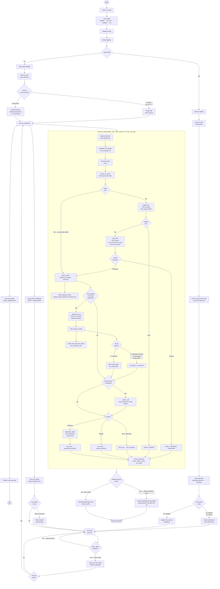

# TE API Scanner — File Processing Logic

```mermaid
flowchart TD
    A([Start]) --> B[Parse CLI args]
    B --> C[Load config\ndefaults → env vars → config.ini → CLI]
    C --> D[Validate config]
    D --> E[Setup logging]
    E --> F{--watch flag?}

    %% ─────────── ONE-SHOT MODE ───────────
    F -- No --> G[ONE-SHOT MODE]
    G --> H[discover_files\ninput_directory]
    H --> I{Archive\nor Non-archive?}

    I -- "Archive\n.zip .rar .7z ..." --> J[Sequential\nmain process]
    I -- Non-archive --> K[Parallel workers\nmultiprocessing.Pool\nn = concurrency]

    J --> L[process_single_file]
    K --> L

    L --> DONE_OS[find_and_delete\nempty_subdirectories]
    DONE_OS --> ROT[Rotate & cleanup logs]
    ROT --> Z([Exit])

    %% ─────────── WATCH MODE ───────────
    F -- Yes --> WM[WATCH MODE]
    WM --> WM1[discover_files\nexisting files]
    WM1 --> WM2[process_discovered_files\none-time initial scan]
    WM2 --> WM3[start_watching\nwatchdog observer — blocking]

    WM3 --> EV{File system\nevent}
    EV -- "on_created\non_moved" --> PQ[Add to pending set\nreset quiet timer]
    EV -- on_modified --> PQ2[Update last_activity\ntimestamp]
    PQ --> POLL
    PQ2 --> POLL

    POLL[Poll loop\nevery 2s] --> BR{batch_delay\nelapsed?}
    BR -- "No → keep watching" --> POLL
    BR -- "Yes → batch ready" --> BAT["Pop up to max_batch\nfiles from pending"]
    BAT --> BEXIST{File still\nexists?}
    BEXIST -- No --> POLL
    BEXIST -- Yes --> L

    L --> EMAIL[send_batch_notification\nSMTP + optional IMAP]
    EMAIL --> CLEAN[find_and_delete\nempty_subdirectories]
    CLEAN --> LROT{Log rotation\ncheck}
    LROT -- "Daily or size limit" --> LROT2[Rotate log file\ngzip old logs]
    LROT2 --> POLL
    LROT -- No --> POLL

    %% ─────────── PER-FILE PIPELINE ───────────
    subgraph PF["process_single_file(file_name, path, config, url, url_tex, zip_mgr)"]
        direction TB

        PF1[Sanitize filename\nsafe_filename.py] --> PF2[Instantiate TE handler\nte_file_handler.TE]
        PF2 --> PF3[Compute SHA1\nof file]
        PF3 --> PF4[check_te_cache\nGET /query with SHA1]

        PF4 --> PF5{Cache\nhit?}
        PF5 -- "Yes → use cached verdict" --> PF8
        PF5 -- No --> PF6["upload_file\nPOST /upload\nwith request JSON"]

        PF6 --> PF7{Upload\nOK?}
        PF7 -- Error --> PF_ERR[verdict = ERROR]
        PF7 -- OK --> PF7A["query_file\nPOLL /query\nevery seconds_to_wait\nup to max_retries"]

        PF7A --> PF7B{Verdict\nreceived?}
        PF7B -- Timeout --> PF7C[verdict = PENDING / UNKNOWN]
        PF7B -- Received --> PF8[parse_verdict\nMalicious / Benign / Unknown]

        PF8 --> PF8A["Write response JSON\nreports_dir/sub_dir/file.TE.response.txt"]

        PF8 --> TEX_CHK{"TEX enabled\n& file type\nsupported?"}
        TEX_CHK -- Yes --> TEX1["_upload_for_tex\nPOST to TEX API\nbase64 encoded"]
        TEX1 --> TEX2[TEX.process_results]
        TEX2 --> TEX3["Write scrub response JSON\ntex_response_info/"]
        TEX2 --> TEX4{Scrub\nstatus?}
        TEX4 -- "0 = Cleaned" --> TEX5["Write cleaned file\ntex_clean_files/"]
        TEX4 -- "4 = Nothing to remove\n7 = Encrypted\nOther codes" --> TEX6[Log status, no clean file]
        TEX_CHK -- No --> ZIP_CHK

        TEX5 --> ZIP_CHK
        TEX6 --> ZIP_CHK

        ZIP_CHK{ZIP password\nconfigured?} -- Yes --> ZIP1[_add_to_zip\ncopy to temp dir or add directly]
        ZIP_CHK -- No --> VERD
        ZIP1 --> VERD

        VERD{Verdict?}

        VERD -- Malicious --> MAL1["download_report\nGET /download\nreport.tar.gz"]
        MAL1 --> MAL2[move_file → quarantine_directory]

        VERD -- Benign --> BEN[move_file → benign_directory]

        VERD -- "Error / Unknown" --> ERR[move_file → error_directory]

        MAL2 --> RET["Return result dict\nname, verdict, status, tex_status"]
        BEN --> RET
        ERR --> RET
        PF_ERR --> RET
        PF7C --> RET
    end

    L --> PF

    %% ─────────── ZIP CONSOLIDATION ───────────
    PF --> ZIP_CONS{Multiprocessing\nmode?}
    ZIP_CONS -- "Yes → after all workers done" --> ZC["ZipArchiveManager.consolidate\nmerge temp dir into AES-256 zip"]
    ZIP_CONS -- "No / watch mode" --> ZC2["ZipArchiveManager.close\nfinalize zip file"]
    ZC --> DONE_FILE
    ZC2 --> DONE_FILE
    DONE_FILE([Files processed])
```
